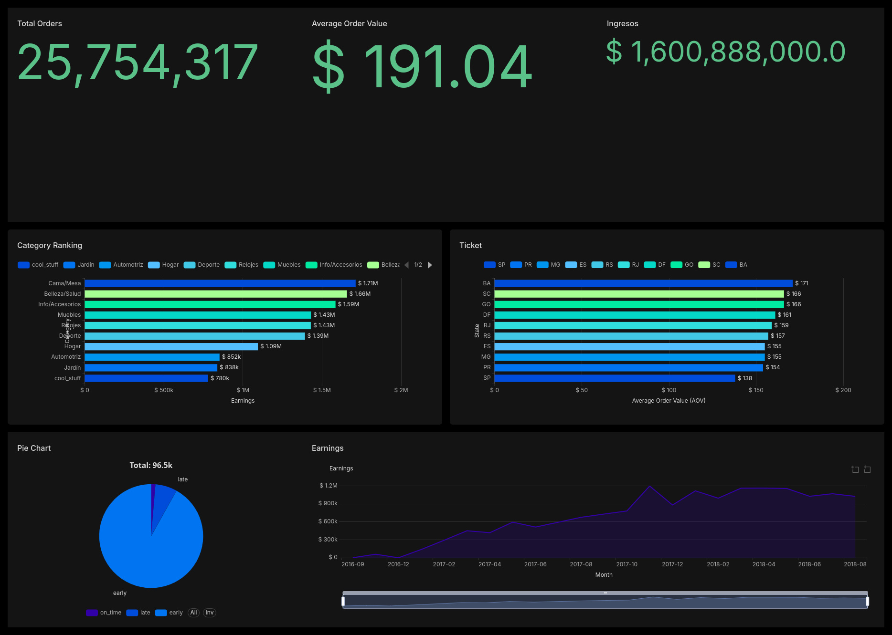

# 01 — E-commerce Olist: Análisis de Ventas y Retención

> "¿Cómo optimizar ingresos y retención en una tienda online?"



## Problema de negocio

Olist es un marketplace brasileño con ~100k pedidos. Este análisis busca identificar:
1. Categorías y productos que más ingresos generan
2. Evolución temporal de pedidos e ingresos
3. Ticket promedio por región
4. Cumplimiento de plazos de entrega
5. **Retención de clientes** (análisis de cohortes)

## Stack

- **SQL:** PostgreSQL — CTEs, window functions, cohortes, views
- **Python:** Pandas, Matplotlib (EDA + visualización)
- **Apache Superset:** Dashboard interactivo

## Insights clave

1. **Retención bajísima** — la mayoría de clientes no vuelve a comprar después de su primer pedido
2. **7% de pedidos llegan tarde** — identificar estados con más retrasos para optimizar logística
3. **Pico irregular noviembre 2017** — posible Black Friday, investigar si fue por categoría o evento estacional
4. **Ticket alto + pocas órdenes** en ciertas regiones → oportunidad de aumentar volumen con marketing
5. **Ticket bajo + muchas órdenes** → oportunidad de aumentar ticket con cross-sell y upsell

Ver [insights.md](insights.md) para el análisis completo.

## SQL — Views

| View | Descripción |
|------|-------------|
| `vw_category_rank` | Ranking de categorías por ingresos |
| `vw_items_rank` | Ranking de productos por ingresos |
| `vw_orders_earnings` | Ingresos diarios |
| `vw_orders_earnings_month` | Ingresos mensuales con acumulado |
| `vw_ticket_region` | Ticket promedio por estado |
| `vw_delivery_performance` | Cumplimiento de entregas |
| `vw_cohort` | Análisis de cohortes (retención) |

## Estructura

```
01-ecommerce-olist/
├── data/           ← Dataset Olist (Kaggle) + load_to_postgres.py
├── sql/            ← Queries analíticas + views
├── python/         ← EDA + visualizaciones
├── dashboard/      ← Screenshot del dashboard
└── insights.md     ← Conclusiones de negocio
```

## Dataset

[Brazilian E-Commerce by Olist](https://www.kaggle.com/datasets/olistbr/brazilian-ecommerce)
